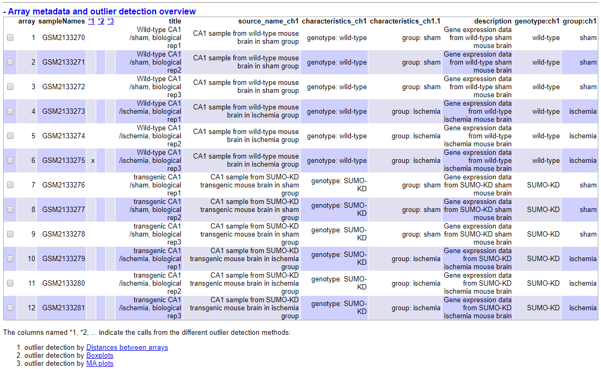

```{r setup, include = FALSE}
library(knitr)
knitr::opts_chunk$set(echo = TRUE, message = FALSE, warning = FALSE, 
                      comment = NA, prompt = TRUE, tidy = FALSE, 
                      fig.width = 7, fig.height = 7, fig_caption = TRUE,
                      cache=FALSE)
```


```{r include = FALSE}

# Paquetes
if (!(require(knitr))) install.packages("knitr")
if (!(require(BiocManager))) install.packages("BiocManager")
if (!(require(gplots))) install.packages("gplots")
if (!(require(ggplot2))) install.packages("ggplot2")
if (!(require(ggrepel))) install.packages("ggrepel")
if (!(require(plyr))) install.packages("plyr")
if (!(require(GEOquery))) BiocManager::install("GEOquery")
if (!(require(arrayQualityMetrics))) BiocManager::install("arrayQualityMetrics")
if (!(require(vsn))) BiocManager::install("vsn")
if (!(require(genefilter))) BiocManager::install("genefilter")
if (!(require(limma))) BiocManager::install("limma")
if (!(require(org.Hs.eg.db))) BiocManager::install("org.Hs.eg.db")
if (!(require(ReactomePA))) BiocManager::install("ReactomePA")
if (!require("Biobase"))             BiocManager::install("Biobase")
if (!require("oligo"))               BiocManager::install("oligo")
if (!(require(mouse430a2.db))) BiocManager::install("mouse430a2.db")

library(Biobase)
library(oligo)
library(mouse430a2.db)
library(arrayQualityMetrics)
```


# Abstract

El término "SUMOylation" hace referencia a la modificación post-transcripcional de SUMO (Small ubiquitin-like modifier). Esta SUMOylation juega un papel importante en las funciones neurológicas. La SUMOylation neuronal es especialmente importante para una serie de procesos, y esta se ve drásticamente activada en neuronas post-isquemia como parte de un sistema de protección neurológica a la isquemia.
Esta SUMOylation es capaz de regular la expresión génica neuronal, tanto en estado fisiológico y tras isquemia.


# Objetivos

En este estudio se usan ratones knockdown para la expresión neuronal de SUMO. Los ratones Wild-type (WT) y knockdown para SUMO se sometieron a isquemia cerebral y se llevaron a cabo analisis de microarray en muestras hipocampales CA1.

En este informe se realiza un análisis de los perfiles de expresión génica con los datos del estudio, realizando las comparaciones pertinentes.

Se pretende estudiar en última instancia cómo la SUMOylation modula la expresión génica depués de isquemia cerebral.


# Materiales y Métodos

## Naturaleza de los datos, tipo y diseño de experimento, tipo de microarrays utilizados

Plataforma: Affymetrix Mouse Genome 430A 2.0 Array

Los ratones WT y knockdown se sometieron a isquemia o a cirugía sham (placebo, condiciones fisiológicas). Se recolectaron muestras hipocampales CA1 a las 3 horas. La reperfusión fue analizada usando Affymetrix microarrays.

Los datos han sido cargados directamente haciendo uso del paquete `GEOquery`. Se usó código en R para obtener el nombre del corresponiente paquete de anotaciones.

```{r include = FALSE}
gse <- getGEO("GSE80681", GSEMatrix = TRUE)
eset <- gse[[1]]
```

```{r message=F, warning=F}
fun <- function(GDSDataobj){
fulltitle <- Meta(GDSDataobj)$title
title <- strsplit(fulltitle, "\\[|\\]")[[1]][2]
title <- paste0(gsub("_|-| ", "", tolower(title)), ".db")
title
}

eset <- getGEO("GSE80681")[[1]] 
fun(getGEO(annotation(eset)))
```

Tanto los datos como el artículo trabajado son de libre acceso:
https://www.ncbi.nlm.nih.gov/pmc/articles/PMC5319602/

*Gene Expression Omnibus *: número de acceso **GSE143025**  
https://www.ncbi.nlm.nih.gov/geo/query/acc.cgi?acc=GSE80681

Entorno:  
R version 3.6.3 (2020-02-29)  
RStudio Version 1.2.5033  
Bioconductor Version 3.10

**Repositorio en GitHub**: https://github.com/mhbus/ADO_PEC1


# Métodos utilizados en el análisis


## Exploración de grupos y datos

Observamos la distribución de los datos y realizamos el procesamiento que fuera necesario.

```{r echo = FALSE}
pData(eset)[ , 1, drop = FALSE]
```

```{r include = F}
head(exprs(eset))
```

```{r include = F}
grupos <- c("WT.sham", "WT.sham", "WT.sham", "WT.isc", "WT.isc", "WT.isc", "Trans.sham", "Trans.sham", "Trans.sham", "Trans.isc", "Trans.isc", "Trans.isc")

short_name <- c("WT.sham.1", "WT.sham.2", "WT.sham.3", "WT.isc.1", "WT.isc.2", "WT.isc.3", "Trans.sham.1", "Trans.sham.2", "Trans.sham.3", "Trans.isc.1", "Trans.isc.2", "Trans.isc.3")

rownames(pData(eset)) <- short_name 
colnames(eset) <- short_name
```


## Control de calidad

Comprobamos si los datos crudos tienen suficiente calidad para la normalización. Esto evitará que el posible ruido influya en el análisis.

Se usó el paquete `ArrayQualityMetrics` 

```{r include=F}
arrayQualityMetrics(eset)
```

```{r echo=F}

```

Se observa la presencia de outliers detectados por distancia entre arrays y boxplot.

Análisis de componentes principales (PCA) y boxplot de intensidad:

```{r include = FALSE}
plotPCA3 <- function (datos, labels, factor, title, scale, colores, size = 1.5, glineas = 0.25){
  data <- prcomp(t(datos),scale=scale)
  # plot adjustments
   dataDf <- data.frame(data$x)
   Group <- factor
   loads <- round(data$sdev^2/sum(data$sdev^2)*100,1)
   # main plot
   p1 <- ggplot(dataDf,aes(x=PC1, y=PC2)) +
     theme_classic() +
     geom_hline(yintercept = 0, color = "gray70") +
     geom_vline(xintercept = 0, color = "gray70") +
     geom_point(aes(color = Group), alpha = 0.55, size = 3) +
     coord_cartesian(xlim = c(min(data$x[,1])-5,max(data$x[,1])+5)) +
     scale_fill_discrete(name = "Group")
   # avoiding labels superposition
   p1 + geom_text_repel(aes(y = PC2 + 0.25, label = labels),segment.size = 0.25, size = size) + 
     labs(x = c(paste("PC1",loads[1],"%")),y=c(paste("PC2",loads[2],"%"))) +  
     ggtitle(paste("Principal Component Analysis for: ",title,sep=" "))+ 
     theme(plot.title = element_text(hjust = 0.5)) +
     scale_color_manual(values=colores)
}
```

```{r echo = FALSE, fig.align="center", fig.height=4, fig.width=5}
plotPCA3(exprs(eset), labels = short_name, factor = grupos, title = "Raw data", scale = FALSE, size = 3, colores = c("red", "blue", "green", "yellow"))
```

Se aprecia la distribución de los grupos y los porcentajes de variabilidad explicados.


```{r echo = FALSE, fig.align="center", fig.height=4, fig.width=5}
boxplot(exprs(eset), cex.axis=0.5,las=2, col = c(rep("red", 3), rep("blue", 3), rep("green", 3), rep("yellow", 3)), main="Distribution of raw intensity values")
```

Los boxplot obtenidos tienen un aspecto algo particular que no he sabido interpretar del todo, veremos como tras la normalización adquieren un aspecto más "común".


## 3. Normalización

Debido a problemas con `rma()`, se ha optado por otro método de normalización.

```{r include = FALSE}
# Por problemas de procesamiento con rma, la normalización se llevó a cabo con vsn:
#https://www.bioconductor.org/packages/release/bioc/html/vsn.html
normaliz <- vsn2(eset)
```

```{r include = FALSE}
eset_normaliz <- ExpressionSet(assayData=exprs(normaliz),
                          phenoData=eset@phenoData,
                          featureData=eset@featureData,
                          experimentData=eset@experimentData,
                          annotation=eset@annotation)
```

```{r include = FALSE}
eset_normaliz
```


## 4. Control de calidad de los datos normalizados

Se usó el paquete `ArrayQualityMetrics` con los datos normalizados.

```{r include=F}
arrayQualityMetrics(eset_normaliz)
```

```{r echo=F}

```

Parece que se ha conseguido reducir en parte la detección de outliers.

Realizamos de nuevo los análisis de PCA y boxplot y observamos los cambios.

```{r echo = FALSE, fig.align="center", fig.height=4, fig.width=5}
plotPCA3(exprs(eset_normaliz), labels = short_name, factor = grupos, title = "Normalized data", scale = FALSE, size = 3, colores = c("red", "blue","green","yellow"))
```

boxplot.

```{r echo = FALSE, fig.align="center", fig.height=4, fig.width=5}
boxplot(exprs(eset_normaliz), cex.axis=0.5,las=2, col = c(rep("blue", 6), rep("red", 6)), main="Boxplot for arrays intensity: Normalized Data")
```


## 5. Variabilidad de genes, desviaciones

Gráfico que representa las desviaciones estándar de todos los genes (para todas las muestras), ordenados de menor a mayor. 

```{r SDplot, fig.cap="Valores de sd para todas las muestras, todos los genes ordenados de menor a mayor", echo=F}
sds <- apply (exprs(eset_normaliz), 1, sd)
sdsO<- sort(sds)
plot(1:length(sdsO), sdsO, main="Distribución de la variabilidad para todos los genes",
     sub="Líneas verticales: percentiles 90% y 95%",
     xlab="Índice del gen: de menos a más variable", ylab="Desviación estándar")
abline(v=length(sds)*c(0.9,0.95))
```


## 6. Filtraje no específico

Antes de realizar las comparaciones se lleva a cabo un filtraje de los datos normalizados. Se pretende evitar ruido, genes sin una variabilidad significativa.

```{r include = FALSE}
library(genefilter)
library(mouse430a2.db)
annotation(eset_normaliz) <- "mouse430a2.db"
filtered <- nsFilter(eset_normaliz, 
                      require.entrez = TRUE, remove.dupEntrez = TRUE,
                      var.filter = TRUE, var.func = IQR, var.cutoff = 0.75, 
                      filterByQuantile = TRUE, feature.exclude = "^AFFX")
```

```{r include = FALSE}
filtered$filter.log
```

```{r include = FALSE}
eset_filtered <- filtered$eset
filtered$eset
```


Se guardan también los archivos generados de la normalización y el filtrado.

```{r echo = FALSE}
write.csv(exprs(eset_normaliz), file="./results/normalized.Data.csv")
write.csv(exprs(eset_filtered), file="./results/normalized.Filtered.Data.csv")
```


## 7. Identificación de genes diferencialmente expresados

Se usó el paquete `limma` para seleccionar genes expresados diferencialmente.

En primer lugar se diseñó una matriz basada en los grupos:

```{r include = FALSE}
designMat <- model.matrix(~0+grupos, pData(eset_filtered))
colnames(designMat) <- c("WT.sham", "WT.isc", "Trans.sham", "Trans.isc")
rownames(designMat) <- c(1:12)
designMat
```

Posteriormente se diseñaron los contrastes pertinentes al estudio:

```{r include = FALSE}
cont.matrix <- makeContrasts (Trans.shamvsWT.sham = Trans.sham - WT.sham,
                              Trans.iscvsWT.isc = Trans.isc - WT.isc,
                              INT = (Trans.sham - WT.sham) - (Trans.isc - WT.isc),
                              levels=designMat)
print(cont.matrix)
```

Para cada comparación se desea obtener una lista con todos los genes ordenados por p-value (de menor a mayor).

```{r include = FALSE}
fit <- lmFit(eset_filtered, designMat)
fit.main <- contrasts.fit(fit, cont.matrix)
fit.main <- eBayes(fit.main)
```

### Comparaciones

Comparación 1 (Trans.shamvsWT.sham): Genes que varían su nivel de expresión entre knockdown y WildType en condiciones fisiológicas:

```{r, topTabs1}
topTab_Trans.shamvsWT.sham <- topTable (fit.main, number=nrow(fit.main), coef="Trans.shamvsWT.sham", adjust="fdr") 
```

Comparación 2 (Trans.iscvsWT.isc): Genes que varían su nivel de expresión entre knockdown y WildType en condiciones de isquemia:

```{r, topTabs2}
topTab_Trans.iscvsWT.isc <- topTable (fit.main, number=nrow(fit.main), coef="Trans.iscvsWT.isc", adjust="fdr")
```

Para la comparación 3 (INT): Genes que varían su nivel de expresión entre las comparaciones 1 y 2:

```{r, topTabs3}
topTab_INT  <- topTable (fit.main, number=nrow(fit.main), coef="INT", adjust="fdr") 
```

### Visualización de expresión diferencial

Se representa un "Volcano plots" para la comparación entre knockdown y Wild-Type.

```{r echo=FALSE, fig.cap="Volcano plot. Comparación KD y WT."}
library(mouse430a2.db)
geneSymbols <- select(mouse430a2.db, rownames(fit.main), c("SYMBOL"))
SYMBOLS<- geneSymbols$SYMBOL
volcanoplot(fit.main, coef=1, highlight=4, names=SYMBOLS, 
            main=paste("Genes diferencialmente expresados", colnames(cont.matrix)[1], sep="\n"))
  abline(v=c(-1,1))
```


### Comparaciones múltiples

Se usaron las funciones `decideTests` y `VennDiagram` del paquete `limma`.

```{r decideTests.1, echo=FALSE}
library(limma)
res<-decideTests(fit.main, method="separate", adjust.method="fdr", p.value=0.1, lfc=1)
```

```{r resumeDecideTests, echo=FALSE}
sum.res.rows<-apply(abs(res),1,sum)
res.selected<-res[sum.res.rows!=0,] 
print(summary(res))
```

Visualización con Diagrama de Venn:

```{r, fig.cap="Diagrama de Venn", echo=FALSE}
vennDiagram (res.selected[,1:3], cex=0.9)
title("Genes en común entre las comparaciones\n Genes seleccionados con FDR < 0.1 and logFC > 1")
```


### Heatmaps

Es posible visualizar los genes diferencialmente expresados (filtered) por medio de un Heatmap (genes FDR < 0.1 and logFC > 1). 

```{r data4Heatmap, include=F}
probesInHeatmap <- rownames(res.selected)
HMdata <- exprs(eset_filtered)[rownames(exprs(eset_filtered)) %in% probesInHeatmap,]

geneSymbols <- select(mouse430a2.db, rownames(HMdata), c("SYMBOL"))
SYMBOLS<- geneSymbols$SYMBOL
rownames(HMdata) <- SYMBOLS
write.csv(HMdata, file = file.path("./results/data4Heatmap.csv"))
```


```{r echo=F, heatmapClustering, fig.cap="Heatmap for expression data grouping genes (rows) and samples (columns) by their similarity"}

my_palette <- colorRampPalette(c("blue", "red"))(n = 299)

heatmap.2(HMdata,
          Rowv = TRUE,
          Colv = TRUE,
          dendrogram = "both",
          main = "Diferencia de genes expresada \n FDR < 0,1, logFC >=1",
          scale = "row",
          col = my_palette,
          sepcolor = "white",
          sepwidth = c(0.05,0.05),
          cexRow = 0.5,
          cexCol = 0.9,
          key = TRUE,
          keysize = 1.5,
          density.info = "histogram",
          ColSideColors = c(rep("red",3),rep("blue",3), rep("green",3), rep("yellow",3)),
          tracecol = NULL,
          srtCol = 30)

```


## 8. Anotación de los resultados

Usaremos el ID para averiguar el gen correspondiente. Se obtendrán las listas con las anotaciones añadidas

```{r GeneAnnotation, echo=FALSE, message=FALSE, warning=FALSE}
annotatedTopTable <- function(topTab, anotPackage)
{
  topTab <- cbind(PROBEID=rownames(topTab), topTab)
  myProbes <- rownames(topTab)
  thePackage <- eval(parse(text = anotPackage))
  geneAnots <- select(thePackage, myProbes, c("SYMBOL", "ENTREZID", "GENENAME"))
  annotatedTopTab<- merge(x=geneAnots, y=topTab, by.x="PROBEID", by.y="PROBEID")
return(annotatedTopTab)
}
```

```{r annotateTopTables, include=FALSE}
topAnnotated_Trans.shamvsWT.sham <- annotatedTopTable(topTab_Trans.shamvsWT.sham,anotPackage="mouse430a2.db")
topAnnotated_Trans.iscvsWT.isc <- annotatedTopTable(topTab_Trans.iscvsWT.isc,anotPackage="mouse430a2.db")
topAnnotated_INT <-        annotatedTopTable(topTab_INT,       anotPackage="mouse430a2.db")

write.csv(topAnnotated_Trans.shamvsWT.sham, file="./results/topAnnotated_KOvsWT_NOR.csv")
write.csv(topAnnotated_Trans.iscvsWT.isc, file="./results/topAnnotated_KOvsWT_TAM.csv")
write.csv(topAnnotated_INT,        file="./results/topAnnotated_INT.csv")
```


## 9. Análisis de significación biológica 

Se analiza la frecuencia de los identificadores biológicos de los genes expresados diferencialmente entre los grupos con respecto al resto. Se pretende conocer qué vías tienen en común. Se usó el paquete `ReactomePA`.

Se obtiene de esta manera una serie de rutas enriquecidas, estadísticas y diagramas de relaciones.

Listas de genes a analizar, se tienen en cuenta las comparaciones diseñadas anteriormente:

```{r selectGenes, echo=FALSE}
listOfTables <- list(Trans.shamvsWT.sham = topTab_Trans.shamvsWT.sham, 
                     Trans.iscvsWT.isc  = topTab_Trans.iscvsWT.isc, 
                     INT = topTab_INT)
listOfSelected <- list()
for (i in 1:length(listOfTables)){
  # select the toptable
  topTab <- listOfTables[[i]]
  # select the genes to be included in the analysis
  whichGenes<-topTab["adj.P.Val"]<0.15
  selectedIDs <- rownames(topTab)[whichGenes]
  # convert the ID to Entrez
  EntrezIDs<- select(mouse430a2.db, selectedIDs, c("ENTREZID"))
  EntrezIDs <- EntrezIDs$ENTREZID
  listOfSelected[[i]] <- EntrezIDs
  names(listOfSelected)[i] <- names(listOfTables)[i]
}
sapply(listOfSelected, length)
```


```{r, include=FALSE}
mapped_genes2GO <- mappedkeys(org.Mm.egGO)
mapped_genes2KEGG <- mappedkeys(org.Mm.egPATH)
mapped_genes <- union(mapped_genes2GO , mapped_genes2KEGG)
```

Se aplica el análisis de significación biológica a las dos primeras listas.

```{r BiologicalSig, include=F}
library(ReactomePA)

listOfData <- listOfSelected[1:2]
comparisonsNames <- names(listOfData)
universe <- mapped_genes

for (i in 1:length(listOfData)){
  genesIn <- listOfData[[i]]
  comparison <- comparisonsNames[i]
  enrich.result <- enrichPathway(gene = genesIn,
                                 pvalueCutoff = 0.1,
                                 readable = T,
                                 pAdjustMethod = "BH",
                                 organism = "mouse",
                                 universe = universe)
  
  cat("##################################")
  cat("\nComparison: ", comparison,"\n")
  print(head(enrich.result))

  if (length(rownames(enrich.result@result)) != 0) {
  write.csv(as.data.frame(enrich.result), 
             file =paste0("./results/","ReactomePA.Results.",comparison,".csv"), 
             row.names = FALSE)
  
  pdf(file=paste0("./results/","ReactomePABarplot.",comparison,".pdf"))
    print(barplot(enrich.result, showCategory = 15, font.size = 4, 
            title = paste0("Reactome Pathway Analisis para ", comparison,". Barplot")))
  dev.off()
  
  pdf(file = paste0("./results/","ReactomePAcnetplot.",comparison,".pdf"))
    print(cnetplot(enrich.result, categorySize = "geneNum", schowCategory = 15, 
         vertex.label.cex = 0.75))
  dev.off()
  }
}
```
# 10. Resultados

Los resultados obtenidos han sido almacenados.

```{r listOfFiles, echo=F}
listOfFiles <- dir("./results/") 
knitr::kable(
  listOfFiles, booktabs = TRUE,
  caption = 'List of files generated in the analysis',
  col.names="List_of_Files"
)
```

# 11. Discusión

Creo oportuno considerar que los problemas con `rma() y el uso de una alternativa, han podido influir en la normalización de los datos.

Por último quisiera disculparme por la presentación, debido a la cantidad de errores no me ha sido posible presentar un pdf correctamente formateado y presentado. Soy consciente de que la presentación del informe no es la más adecuada.

# Referencias
